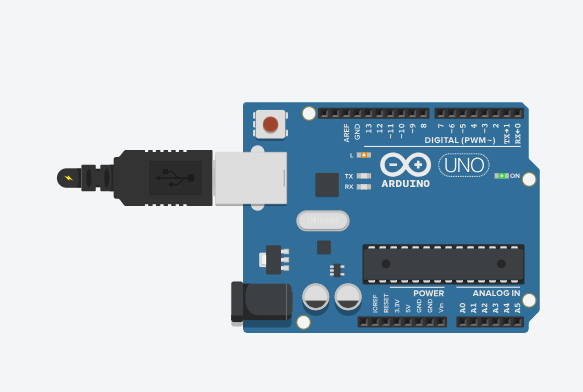

# Arduino mais simples
 Neste experimento faremos com que o LED embutido vinculado ao pino digital 13 (pino digital incorporado LED_BUILTIN = 13) pisque. Este é o experimento mais simples que se poder fazer com o Arduíno.  

  <b><a href="https://www.tinkercad.com/things/8Qu8b09xIDT">Clique Aqui</a></b> para ver o projeto em Tinkercard.com!
 
## Lista de componentes:

- 1  Arduíno UNO R3
- 1  Um cabo de conexão USB

## Esquema do projeto

